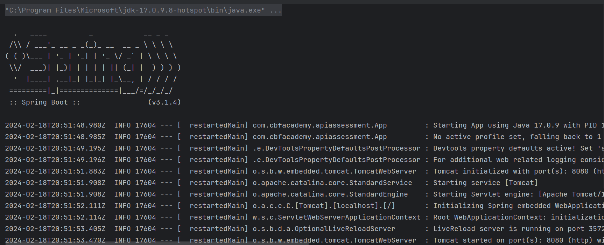
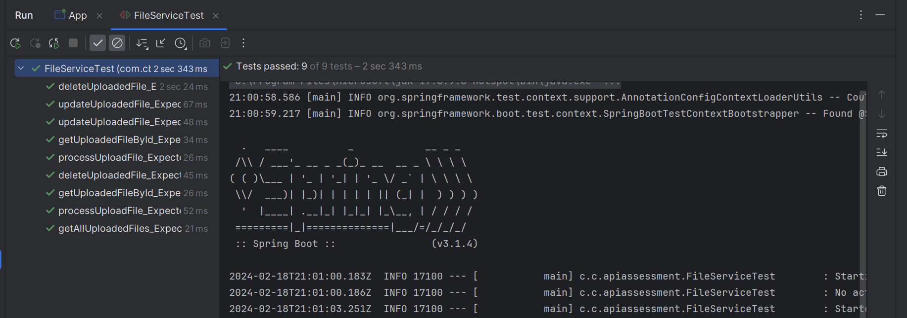
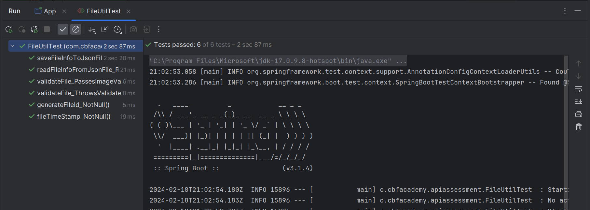
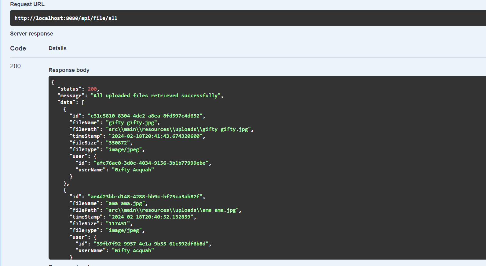
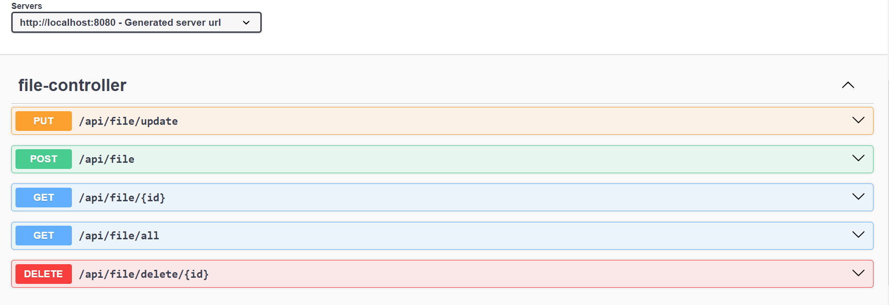
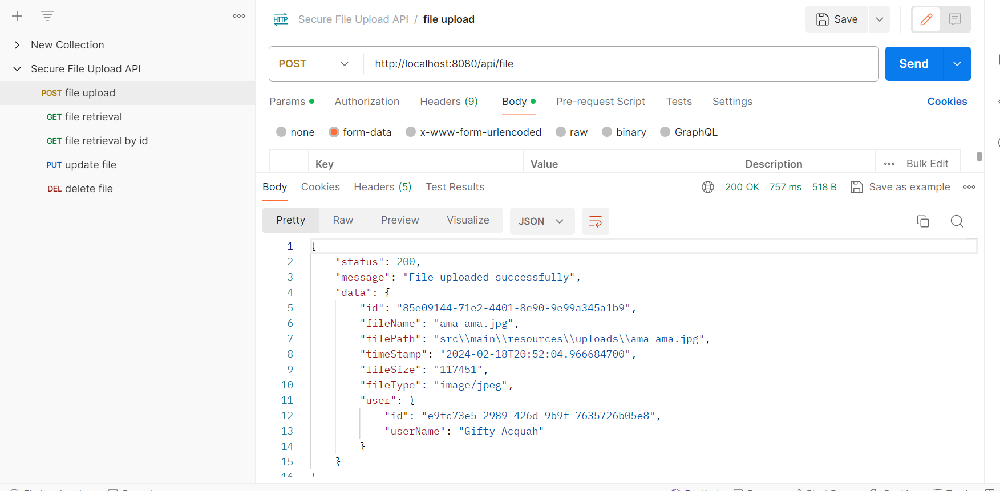

# **Secure File Upload API**
### Table of Contents
<!-- TOC -->
* [**Secure File Upload API**](#secure-file-upload-api)
    * [Table of Contents](#table-of-contents)
  * [**Introduction**](#introduction)
  * [🚀 About Me](#-about-me)
  * [Getting Started](#getting-started)
  * [Prerequisites](#prerequisites)
  * [Setup](#setup)
      * [1. Clone the Repository](#1-clone-the-repository)
      * [2. Install Dependencies](#2-install-dependencies)
    * [3. Running the Application:](#3-running-the-application)
  * [Testing](#testing)
  * [Features](#features)
  * [Tools Used](#tools-used)
  * [Code Overview](#code-overview)
  * [Challenges and Solutions](#challenges-and-solutions)
  * [API Endpoints](#api-endpoints)
  * [Methods for CRUD Operations](#methods-for-crud-operations)
  * [Algorithm](#algorithm)
  * [Additional Information](#additional-information)
  * [Evidence of Inheritance](#evidence-of-inheritance)
  * [Responses](#responses)
  * [Roadmap](#roadmap)
  * [Authors](#authors)
<!-- TOC -->


## **Introduction**
The Secure File Upload API is designed to handle the secure upload of files with a focus on robust security measures. It facilitates CRUD operations for file management, including file upload, retrieval, update, and deletion. The API stores file information in a JSON file and implements features for file validation and malware scanning to ensure the security of uploaded files.

## 🚀 About Me
I am Gifty Acquah, a software developer specializing in cybersecurity, cloud security, and network security. With expertise in Java development, I am proficient in designing and implementing end-point protection solutions. My skills extend to various programming languages including Python, JavaScript, and PowerShell, as well as cloud computing platforms such as AWS Cloud. As an AWS Certified Cloud Practitioner and (ISC)2’s Certified in Cybersecurity professional, I bring a wealth of experience in threat detection and incident response. Additionally, I hold a CompTIA Security+ certification and have received honors and awards for my contributions to cybersecurity challenges.

In addition to my professional experience, I have a strong academic background in Information Technology, having pursued a BSc (Hons) degree from the University of Ghana and completed a course in Security and Resilience: Science and Technology at Imperial College London. I have also been actively involved in volunteering activities, including tutoring at Creative Brain Technologies and Developers In Vogue.

This README serves as documentation for the JAVA API project, which showcases my skills and experience in software development and cybersecurity.

## Getting Started
Follow these steps to set up and run the project locally:

## Prerequisites
Before you begin, make sure you have the following installed:

1. [JDK 17](https://learn.microsoft.com/en-gb/java/openjdk/download#openjdk-17) (or higher)

2. [Git](https://git-scm.com/downloads)

3. [Visual Studio Code](https://code.visualstudio.com/Download)
    1. [Extension Pack for Java](https://marketplace.visualstudio.com/items?itemName=vscjava.vscode-java-pack)
    2. [Spring Boot Extension Pack](https://marketplace.visualstudio.com/items?itemName=vmware.vscode-boot-dev-pack)

Also make sure you have accounts for the following:

1. [GitHub](https://github.com/signup)


## Setup

#### 1. Clone the Repository

```sh
git clone https://github.com/gaatma/java-api-assessment.git
cd java-api-assessment
```

#### 2. Install Dependencies

Open a terminal at the root of the repo directory and run the following command to install the dependencies:

```sh
./mvnw clean dependency:resolve
```

If you are on a Windows machine, that will be:
```cmd
mvnw clean dependency:resolve
```

### 3. Running the Application:

In Visual Studio Code, press F5 or use the 'Play' icon for the 'api-assessment' app in the Spring Boot Dashboard.
Alternatively, from the terminal, run:
```sh
./mvnw spring-boot:run
```

Or on Windows:

```cmd
mvnw spring-boot:run
```

You should see console output similar to the following (press `Ctrl + C` to exit):




## Testing
Unit testing was performed on two classes:
**FileService Class** and **FileUtil Class** to ensure correctness and robustness.

- **FileService Class Test Output**





 - **FileUtil Class Test Output**




## Features
- **Upload:** Accepts file uploads, validates the files, and stores relevant information in a JSON file.
- **Retrieve:** Retrieves information about uploaded files, allowing queries based on various criteria.
- **Update:** Modifies file information in the JSON file when needed.
- **Delete:** Removes uploaded files from the JSON file.


## Tools Used
- **Swagger:** Used for API documentation and testing. [Swagger UI](http://localhost:8080/swagger-ui/index.html#/)
- **Lombok:** Simplified the creation of Java entities.
- **Trello:** Used for project outlining and progress tracking. [Project Board](https://trello.com/b/8Ciyy5Tv/java-projects)
- **Postman:** Used for API testing. [POSTMAN](https://documenter.getpostman.com/view/32424940/2sA2r824bZ)


## Code Overview
The project consists of the following classes:

- **FileBaseResponse:** Defines the response format for API operations.
- **FileController:** Handles incoming HTTP requests and delegates to the FileService.
- **FileService:** Implements business logic for file management operations.
- **FileUtil:** Provides utility functions for file processing.
- **FileUser:** Represents the user associated with uploaded files.
- **FileModel:** Represents the file entity containing file metadata.
- **ValidateFileException:** Custom exception for file validation errors.


## Challenges and Solutions
 - Postman Usage: Initially, using Postman presented a learning curve, but it was overcome by watching online tutorials to improve proficiency.
 - Custom Response Format: Created a specific response format (FileBaseResponse) to enhance the API response.
 - Development Environment: Transitioned from VS Code to IntelliJ for improved development speed and performance.
 - JSON File Creation: Faced challenges in creating a custom JSON file in the resource directory for storing uploaded file details.


## API Endpoints
 - POST /api/file: Upload a file with the specified uploader name.
 - GET /api/file/all: Retrieve all uploaded files.
 - GET /api/file/{id}: Retrieve an uploaded file by its ID.
 - PUT /api/file/update: Update information about an uploaded file.
 - DELETE /api/file/delete/{id}: Delete an uploaded file by its ID.
   

## Methods for CRUD Operations
   - processUploadedFile: Method to upload a file and store relevant information in the JSON file.
   - getAllUploadedFiles: Method to retrieve information about all uploaded files.
   - getUploadedFileById: Method to retrieve an uploaded file by its ID.
   - updateUploadedFile: Method to update information about an uploaded file.
   - deleteUploadedFile: Method to delete an uploaded file by its ID.


## Algorithm
 - The project utilizes the Collections.sort() to sort the list of uploaded files in descending order based on timestamp.
 - Collections.sort() uses the merge sort algorithm under the hood to perform the sorting operation.
 - **Below is the output of the getAllUploadedFiles method sorted by the algorithm**




 - **File Upload Algorithm:**
- **Receive File:**
The API receives the file to be uploaded as a MultipartFile object.
- **Validate File:**
The file undergoes validation using the validateFile() function.
The validateFile() function checks if the file is empty and ensures it is an image.
If validation fails, a custom ValidateFileException is thrown, which is caught in the calling function (processUploadedFile()).
- **Extract File Details:**
Upon successful validation, the details of the file are extracted using built-in functions defined on the MultipartFile class.
- **Generate ID and Save:**
An ID is generated for the uploaded file.
The file details, along with the generated ID, are saved in the JSON file for future reference.


## Additional Information

 - Swagger: Access the API documentation and testing interface at [Swagger UI](http://localhost:8080/swagger-ui/index.html#/)



- Postman Collection: Use Postman for API testing and import the collection from the provided link. [POSTMAN](https://documenter.getpostman.com/view/32424940/2sA2r824bZ)





## Evidence of Inheritance
- I created a custom exception class called ValidateFileException to extends the already existing Exception Class in Java


## Responses

| Status Code             | Description                                                                |
| ----------------- | ------------------------------------------------------------------ |
| 200| OK |
| 500 |  Internel Server Error |
| 400| Bad Request|


## Roadmap
The roadmap for this project entails developing an API that ensures secure file uploads.
This involves addressing potential security risks such as file validation, scanning for malware, and implementing measures to prevent common vulnerabilities like file-based attacks.


## Authors

- Gifty [@gaatma](https://github.com/gaatma)

